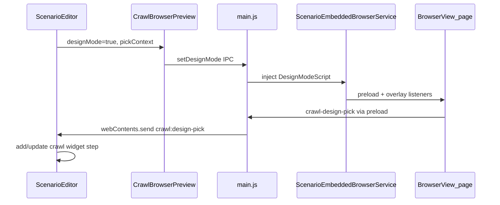

# Crawl Design Mode (Editor Only)

## Mục tiêu

Khi `scenario_type = crawl`:
- Panel trái: browser nhúng + **Design mode** (hover highlight, click chọn element)
- Panel phải: danh sách **crawl widget** + form cấu hình (normal/parent, html/text/attribute, children)
- Nút **DevTools** thủ công (không tự mở)
- Ẩn **Record**, **Xuất bản** và UI record/timeline
- Lưu widget vào `scenario_steps` hiện có (`action_type: 'crawl'`), không thêm bảng DB mới

**Ngoài phạm vi:** Executor chạy extract khi Execute (sẽ làm phase sau).

---

## Kiến trúc



**Lý do inject trong page:** `BrowserView` render native layer phía trên React — không thể vẽ khung highlight bằng JSX overlay. Highlight + chặn click phải chạy trong trang web qua script inject.

---

## 1. Data model — crawl widget step

Lưu mỗi widget là 1 row `scenario_steps`:

```js
{
  action_type: 'crawl',
  delay_ms: 300,
  target_anchor: {
    // anchor gốc (reuse semantic fields từ RecorderService)
    selector_value, xpath, id, ariaLabel, tagName, innerText, element_box, ...
    action_config: {
      widget_type: 'normal' | 'parent',   // normal = 1 element; parent = container lặp item
      extract_mode: 'html' | 'text' | 'attribute',
      attribute_name: '',                  // khi extract_mode === 'attribute'
      label: 'Widget label',              // hiển thị trong list
      children: [
        {
          id: 'uuid',
          label: 'field name',
          target_anchor: { ... },          // anchor element con
          extract_mode: 'html' | 'text' | 'attribute',
          attribute_name: '',
          children: [                      // sub-children (ctrl+shift+click)
            { id, label, target_anchor, extract_mode, attribute_name }
          ]
        }
      ]
    }
  }
}
```

**Quy tắc pick (design mode):**

| Thao tác | Hành vi |
|----------|---------|
| Click | Thêm **widget crawl mới** (root) |
| Shift + Click | Thêm **child** vào widget đang chọn ở panel phải |
| Ctrl + Shift + Click | Thêm **sub-child** vào child đang chọn; script kiểm tra DOM: element clicked phải là descendant của element child đã chọn |

Nếu không có widget/child đang chọn → Shift/Ctrl+Shift hiện toast cảnh báo.

---

## 2. Main process — design mode + DevTools

### Tách anchor logic dùng chung

Extract `getAnchor`, `pickSelector`, `buildXpath` từ [`RecorderService.js`](src/main/rpa/RecorderService.js) (~L1128–1185) sang module mới [`src/main/rpa/ElementAnchorScript.js`](src/main/rpa/ElementAnchorScript.js) — export chuỗi JS injectable (RecorderService import lại sau, tránh duplicate).

### Design mode script

Tạo [`src/main/rpa/DesignModeScript.js`](src/main/rpa/DesignModeScript.js):
- Overlay `position:fixed` theo `getBoundingClientRect()` khi `mousemove`
- Tooltip nhỏ: `tagName · selector` (giống Cursor screenshot)
- `click` capture phase: `preventDefault` + `stopPropagation` khi design mode bật
- Gửi pick qua `window.__rpaDesign.sendPick({ anchor, selector_value, pickKind, modifiers })`
- Validate sub-child: `childAnchorElement.contains(clickedElement)` (resolve bằng selector/xpath trong page)

### Preload riêng cho BrowserView

Tạo [`src/preload/crawl-design-preload.cjs`](src/preload/crawl-design-preload.cjs):
```js
contextBridge.exposeInMainWorld('__rpaDesign', {
  sendPick: (payload) => ipcRenderer.send('crawl:design-pick', payload),
  sendHover: (payload) => ipcRenderer.send('crawl:design-hover', payload),
});
```

Gắn preload này vào `BrowserView` trong [`ScenarioEmbeddedBrowserService.js`](src/main/browser/ScenarioEmbeddedBrowserService.js) (chỉ partition preview, không ảnh hưởng main renderer).

### Mở rộng `ScenarioEmbeddedBrowserService`

- `setDesignMode(enabled, pickContext)` — inject/remove script, toggle cursor
- `openDevTools()` — `view.webContents.openDevTools({ mode: 'detach' })`
- Re-inject sau mỗi navigation (`did-finish-load`) khi design mode đang bật

### IPC mới trong [`main.js`](src/main/main.js) + [`preload.cjs`](src/preload/preload.cjs)

| Channel | Hướng | Mục đích |
|---------|-------|----------|
| `scenario:crawl-preview:set-design-mode` | invoke | Bật/tắt design mode |
| `scenario:crawl-preview:open-devtools` | invoke | Mở DevTools thủ công |
| `crawl:design-pick` | send (BrowserView→main) | Element được chọn |
| `crawl:design-hover` | send (optional) | Sync hover label sang renderer |
| `crawl:design-pick` relay | main→renderer | `mainWindow.webContents.send('crawl:design-pick', payload)` |

Renderer subscribe qua `onCrawlDesignPick(callback)` trong preload (trả cleanup function).

---

## 3. Renderer — UI crawl-only

### Phân tách mode trong [`ScenarioEditor.jsx`](src/renderer/components/ScenarioEditor.jsx)

```js
const isCrawlMode = scenarioType === 'crawl';
const isLivePreviewMode = scenarioType === 'crawl' || scenarioType === 'action';
```

- `isLivePreviewMode`: giữ browser preview trái (crawl + action)
- `isCrawlMode`: bật design mode UI, crawl widget list, ẩn record controls

### Ẩn nút khi `isCrawlMode`

Trong header (~L1838–1863):
- **Ẩn:** Record/Stop, Xuất bản
- **Giữ:** Save, Import, Export, Variables, Back

### [`CrawlBrowserPreview.jsx`](src/renderer/components/CrawlBrowserPreview.jsx)

Thêm toolbar (chỉ khi `scenarioType === 'crawl'`):
- **Design** toggle (active state giống Cursor — border xanh)
- **DevTools** button (mở thủ công qua IPC)
- Truyền `designMode`, `pickContext`, `onDesignModeChange` từ ScenarioEditor

Khi design mode bật: disable URL navigation tạm thời hoặc vẫn cho navigate nhưng re-inject sau load.

### Component mới: [`CrawlWidgetPanel.jsx`](src/renderer/components/CrawlWidgetPanel.jsx)

Thay `StepEditPanel` + `ActionIconBar` khi `isCrawlMode`:

**Widget list (trái trong panel phải):**
- Card mỗi crawl step: label, widget_type badge, selector ngắn
- Select widget → set `selectedCrawlWidgetId`
- Delete widget

**Form settings (khi widget được chọn):**
- `widget_type`: normal | parent
- `extract_mode`: html | text | attribute
- `attribute_name` (hiện khi mode = attribute)
- `label` (tên field hiển thị)

**Children section** (list có add/edit/remove):
- Mỗi child: label, extract_mode, attribute_name, selector preview
- Select child → `selectedChildId` (dùng cho Shift/Ctrl+Shift pick)
- Sub-children nested list tương tự

**Helper:** `createCrawlWidgetFromPick(pickPayload, pickKind, selectedWidget, selectedChild)` trong [`src/renderer/utils/crawlWidget.js`](src/renderer/utils/crawlWidget.js).

### ScenarioEditor state mới

- `designMode` boolean
- `selectedCrawlWidgetId`, `selectedChildId`, `selectedSubChildId`
- `useEffect` listen `onCrawlDesignPick` → gọi helper → `setSteps` + auto-select widget mới

---

## 4. i18n

Thêm keys vào [`vi.js`](src/renderer/i18n/locales/vi.js) / [`en.js`](src/renderer/i18n/locales/en.js):

- `scenarioEditor.designMode`, `openDevTools`
- `crawlWidget.type`, `crawlWidget.normal`, `crawlWidget.parent`
- `crawlWidget.extractMode`, `crawlWidget.html`, `crawlWidget.text`, `crawlWidget.attribute`
- `crawlWidget.children`, `crawlWidget.subChildren`
- Toast: `pickNeedsWidget`, `pickNeedsChild`, `subChildNotDescendant`

---

## 5. Kiểm tra

1. `npm run build:renderer` — renderer compile
2. `npm run dev` — manual test:
   - Tạo scenario type=crawl → không thấy Record/Xuất bản
   - Bật Design → hover có khung, click thêm widget
   - Chọn widget → Shift+click thêm child
   - Chọn child → Ctrl+Shift+click thêm sub-child (valid/invalid DOM)
   - DevTools button mở inspector
   - Save → reload scenario → widgets persist

---

## Files chính sẽ thay đổi

| File | Thay đổi |
|------|----------|
| [`ScenarioEditor.jsx`](src/renderer/components/ScenarioEditor.jsx) | `isCrawlMode`, ẩn nút, crawl widget flow |
| [`CrawlBrowserPreview.jsx`](src/renderer/components/CrawlBrowserPreview.jsx) | Design + DevTools toolbar |
| [`ScenarioEmbeddedBrowserService.js`](src/main/browser/ScenarioEmbeddedBrowserService.js) | preload, design mode, devtools |
| [`main.js`](src/main/main.js) | IPC handlers + relay pick events |
| [`preload.cjs`](src/preload/preload.cjs) | API design mode + event listener |
| **New** `crawl-design-preload.cjs` | Bridge BrowserView → main |
| **New** `DesignModeScript.js` | Inject hover/pick |
| **New** `ElementAnchorScript.js` | Shared anchor helpers |
| **New** `CrawlWidgetPanel.jsx` | Widget settings UI |
| **New** `crawlWidget.js` | Create/update widget helpers |
